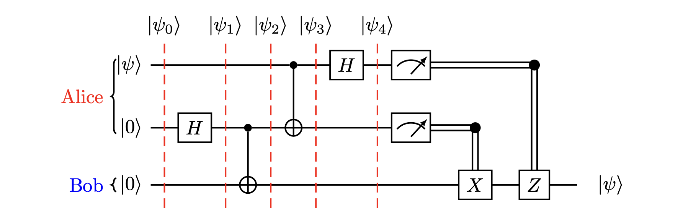
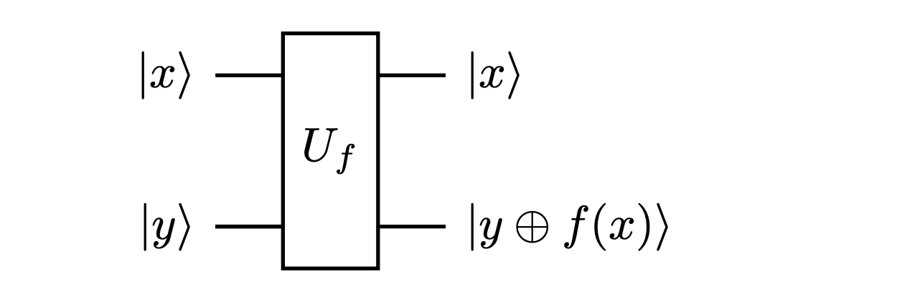
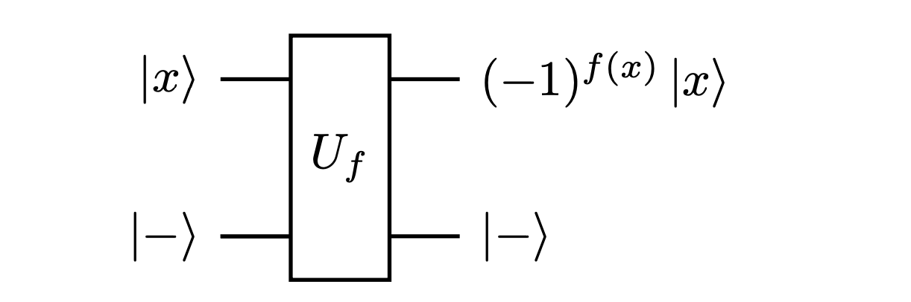
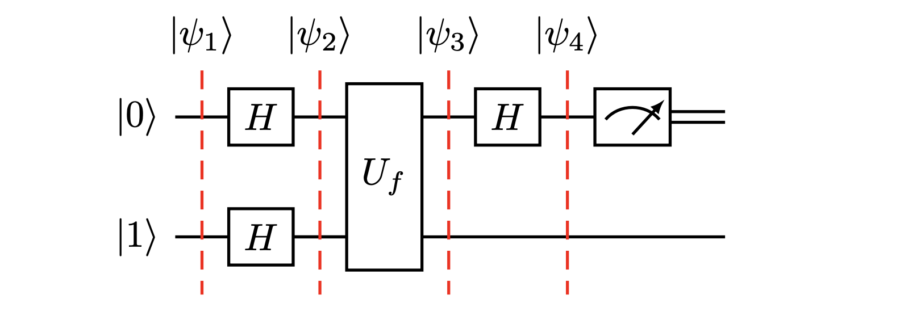

# Quantum Computing and Information: An Introduction with Qiskit
On this page, you'll find a beginner-friendly guide to quantum computing and information, completed with code examples using Qiskit. This approach integrates the typically separate subjects of quantum mechanics, quantum computing, and quantum information programming.


# Table of Contents
1. [Qubit](#qubit)
   1. [Dirac Notation](#dirac-notation)
   2. [Vector Representation](#vector-representation)
   3. [Bloch Sphere Representation](#bloch-sphere-representation)
2. [Tensor Product](#tensor-product)
   1. [Tensor Product of Quantum States](#tensor-product-of-quantum-states)
   2. [Dimensionality of Multi-Qubit Systems](#dimensionality-of-multi-qubit-systems)
3. [Operators](#operators)
   1. [Introduction to Circuits](#introduction-to-circuits)
   2. [Create a circuit](#create-a-circuit)
   3. [Unitary Operators](#unitary-operators)
   4. [Properties of Unitary Operators](#properties-of-unitary-operators)
4. [Entangled State](#entangled-state)
   1. [The Bell State](#the-bell-state)
   2. [Simulating Bell State](#simulating-bell-state)
5. [Entanglement Circuits](#entanglement-circuits)


## Qubit

A qubit is the fundamental unit of quantum information in quantum computing. Unlike a classical bit which can be either 0 or 1, a qubit can exist in a superposition of both states.

### Dirac Notation

In the algebraic approach, within the framework of Hilbert space, a qubit is represented as a linear combination of the basis states $|0\rangle$ and $|1\rangle$ (ket). The general state of a qubit is given by:

$$ |\psi\rangle = \alpha|0\rangle + \beta|1\rangle, $$

where $\alpha$ and $\beta$ are complex numbers from the complex field $\mathbb{C}$. These coefficients represent the probability amplitudes of the qubit being in the respective states. 

The coefficients $\alpha$ and $\beta$ in the qubit state $|\psi\rangle = \alpha|0\rangle + \beta|1\rangle$ have a probabilistic interpretation. 

- $|\alpha|^2$ is the probability of the qubit being in the $|0\rangle$ state,
- $|\beta|^2$ is the probability of the qubit being in the $|1\rangle$ state.

Since these are probabilities, they must adhere to the fundamental rule of probability that the sum of all probabilities must equal 1. This leads to the normalization condition for a qubit:

$$ |\alpha|^2 + |\beta|^2 = 1$$

Notes that $\alpha + \beta = 1$ is not correct because $\alpha$ and $\beta$ are complex so we need to do $|\alpha|^2=\text{Re}(\alpha)^2+\text{Im}(\alpha)^2$ and same with $\beta$. 


### Vector Representation

In vector notation, the qubit can be represented as:

$$|\psi\rangle = \begin{bmatrix} \alpha \\
\beta \end{bmatrix}$$

where this is a column vector. In this representation, a classical bit in state 0 is represented as:

$$|0\rangle = \begin{bmatrix} 1 \\
0 \end{bmatrix}$$


and a classical bit in state 1 is represented as:

$$ |1\rangle = \begin{bmatrix} 0 \\
1 \end{bmatrix}$$


```python
from qiskit.visualization import plot_bloch_vector
%matplotlib inline

# Coordinates for the |0> state
state_0 = [0, 0, 1]

# Plotting the Bloch vector
plot_bloch_vector(state_0, title="Bloch Sphere Representation of |0>")
```


```python
from qiskit.visualization import plot_bloch_vector
%matplotlib inline

# Coordinates for the |0> state
state_0 = [0, 0, -1]

# Plotting the Bloch vector
plot_bloch_vector(state_0, title="Bloch Sphere Representation of |1>")
```


### Bloch Sphere Representation

We can also represent $\alpha$ and $\beta$ in the polar form. Since each complex number typically has two degrees of freedom (phase and amplitude), $|\psi\rangle$ appears to have four degrees of freedom However, the normalization condition

$$|\alpha|^2 + |\beta|^2 = 1$$ 

removes one degree of freedom. By adopting a suitable coordinate transformation, such as the Hopf coordinates, one of these degrees of freedom can be eliminated. The transformation is expressed as:

- $\alpha = e^{i\delta} \cos{\frac{\theta}{2}}$,
- $\beta = e^{i(\delta + \varphi)} \sin{\frac{\theta}{2}}$.

where $\theta \in [0, \pi]$.
Furthermore, for a single qubit, the global phase $e^{i\delta}$ does not affect physical observables. This allows us to set either $\alpha$ or $\beta$ (whichever is non-zero) to be real, reducing the degrees of freedom to just two:

- $\alpha = \cos{\frac{\theta}{2}}$,
- $\beta = e^{i\varphi} \sin{\frac{\theta}{2}}$,

where $e^{i\varphi}$ represents the relative phase, which is physically significant.

We end up with two independent parameters defining the state of a single qubit:

- $\theta \in [0, \pi]$: This angle determines the probabilities associated with the qubit being in the $|0\rangle$ or $|1\rangle$ state. It's often referred to as the polar angle on the Bloch sphere.
- $\varphi \in [0, 2\pi]$: This is the relative phase between the $|0\rangle$ and $|1\rangle$ states. It influences the interference patterns in quantum algorithms and is represented as the azimuthal angle on the Bloch sphere.

These two parameters, $\theta$ and $\varphi$, fully describe the state of a qubit on the Bloch sphere, encapsulating both its amplitude and phase information in a compact, geometric form.


```python
# Parameters
theta = np.pi/2  # Example value for theta [0, pi]
phi = np.pi / 4    # Example value for phi [0, 2*pi]

# State vector for the qubit
psi = [
    np.cos(theta / 2),
    np.exp(1j * phi) * np.sin(theta / 2)
]

# plot psi on block sphere
plot_bloch_multivector(psi)
```


Congratulation, you just simulated your first qubit!


## Tensor Product

### Tensor Product of Quantum States

> **Tensor Product of Quantum States: $|A,B\rangle$**
>
> The notation $|A,B\rangle = |A\rangle \otimes |B\rangle$ represents the tensor product of two quantum states, $|A\rangle$ and $|B\rangle$. In quantum computing, this notation is used to describe the combined state of two quantum systems. The tensor product is a mathematical operation that takes two individual quantum states and combines them into a single state in a larger Hilbert space.
>
> - $|A\rangle$ and $|B\rangle$: These are the quantum states of two separate quantum systems. They can be individual qubits or systems of multiple qubits.
> - $\otimes$: This symbol denotes the tensor product operation. It combines the states in a way that preserves their individual properties while creating a joint state space.
> - $|A,B\rangle$: This is the resulting quantum state after applying the tensor product. It represents the state of the combined system.
>
> The tensor product allows quantum systems to exhibit entanglement, a fundamental property in quantum mechanics where the quantum states of two or more objects become interconnected and the state of one cannot be completely described without the state of the others.

### Dimensionality of Multi-Qubit Systems


In quantum computing, the dimensionality of a multi-qubit system is crucial for understanding the complexity and capabilities of quantum states. For a system consisting of multiple qubits, the dimensionality of the combined state space is the product of the dimensions of the individual qubits' state spaces.

 - A single qubit has a state space of dimension 2, represented by the basis states $|0\rangle$ and $|1\rangle$.
 - For a system of $n$ qubits, each contributing a 2-dimensional state space, the total dimensionality of the system is $2^n$.
 - This exponential growth in dimensionality with each additional qubit is a key feature that enables quantum computers to process and store vast amounts of information. It forms the basis for the potential computational superiority of quantum computers over classical computers for certain tasks.

 For example, a two-qubit system has a dimensionality of $2^2 = 4$, with basis states $|00\rangle$, $|01\rangle$, $|10\rangle$, and $|11\rangle$. 
 
 - In vector notation, the basis states $|00\rangle$, $|01\rangle$, $|10\rangle$, and $|11\rangle$ are represented as follows:
   
 $$|00\rangle = \begin{bmatrix} 1 \\
 0 \\
 0 \\
 0 \end{bmatrix}, \quad |01\rangle = \begin{bmatrix} 0 \\
 1 \\
 0 \\
 0 \end{bmatrix}, \quad |10\rangle = \begin{bmatrix} 0 \\
 0 \\
 1 \\
 0 \end{bmatrix}, \quad |11\rangle = \begin{bmatrix} 0 \\
 0 \\
 0 \\
 1 \end{bmatrix}$$


 Similarly, a three-qubit system has a dimensionality of $2^3 = 8$, with basis states ranging from $|000\rangle$ to $|111\rangle$.

## Operators

### Introduction to Circuits

One of the most basic and important superpositions in quantum computing involves both $\alpha$ and $\beta$ being real numbers and equal, such as in the state:

$$|\psi\rangle = \frac{1}{\sqrt{2}}|0\rangle + \frac{1}{\sqrt{2}}|1\rangle = \frac{1}{\sqrt{2}}\begin{bmatrix} 1 \\
1 \end{bmatrix}$$

To transform a qubit from the state $|0\rangle$ to this superposition state, we use the Hadamard gate. The Hadamard gate is a fundamental quantum gate that creates a superposition of states. It is represented by the matrix:

$$H = \frac{1}{\sqrt{2}}\begin{bmatrix} 1 & 1 \\
1 & -1 \end{bmatrix}$$

When the Hadamard gate is applied to the state $|0\rangle$, it transforms the state as follows:

$$H|0\rangle = \frac{1}{\sqrt{2}}\begin{bmatrix} 1 & 1 \\
1 & -1 \end{bmatrix}\begin{bmatrix} 1 \\
0 \end{bmatrix} = \frac{1}{\sqrt{2}}\begin{bmatrix} 1 \\
1 \end{bmatrix} = \frac{1}{\sqrt{2}}(|0\rangle + |1\rangle)$$

This results in an equal superposition of the $|0\rangle$ and $|1\rangle$ states, a fundamental aspect of quantum computing that enables quantum algorithms to explore multiple possibilities simultaneously.


1. **Applying the Hadamard Gate Again to $\frac{1}{\sqrt{2}}(|0\rangle + |1\rangle)$**

When the Hadamard gate is applied to the state $\frac{1}{\sqrt{2}}(|0\rangle + |1\rangle)$, the transformation is as follows:

$$H \left( \frac{1}{\sqrt{2}}(|0\rangle + |1\rangle) \right) = H \left( \frac{1}{\sqrt{2}} \begin{bmatrix} 1 \\
1 \end{bmatrix} \right) = \frac{1}{\sqrt{2}}\begin{bmatrix} 1 & 1 \\
1 & -1 \end{bmatrix}\frac{1}{\sqrt{2}}\begin{bmatrix} 1 \\
1 \end{bmatrix} = \begin{bmatrix} 1 \\
0 \end{bmatrix} = |0\rangle.$$

Thus, applying the Hadamard gate again to the superposition state brings the qubit back to the $|0\rangle$ state.

You may have noticed that applying the Hadamard gate $H$ twice to a quantum state returns it to its original state. This behavior is not coincidental but a fundamental property. Hadamard gates are what we call a unitary operator in quantum computing. Unitary operators, such as the Hadamard gate, play a crucial role in the coherent and reversible evolution of quantum states. (Notes: Applying an unitary operator two times don't necessary give back the original state. Most will not but Hadamard gate is specific. We will see why below)


### Create a circuit

Manipulating a qubit can be fun, but multiple one simulatunously is even better.

```python
qc = QuantumCircuit(2) # Create a quantum circuit with two qubits
qc.h(0) # Apply a Hadamard gate to the first qubit
qc.draw("mpl") # Draw the circuit
```

This approach allows us to observe the impact of the Hadamard gate $H$ on the first qubit and compare it with the second one

```python
# Use the statevector simulator to get the final state
simulator = Aer.get_backend('statevector_simulator') 
result = execute(qc, simulator).result()
statevector = result.get_statevector()

# Visualize the qubit state on the Bloch sphere
plot_bloch_multivector(statevector)
```


### Unitary Operators


Unitary operators play a fundamental role in quantum mechanics and quantum computing. They are key to understanding quantum gate operations, including the behavior of the Hadamard gate. Here's an in-depth look at unitary operators:

> **Unitary Operator**
>
> A **Unitary Operator** $U$ in quantum computing is a linear operator that satisfies the condition:
>
> $$U^\dagger U = UU^\dagger = I$$
>
> where:
> - $U^\dagger$ is the conjugate transpose (also known as the Hermitian adjoint) of $U$,
> - $I$ is the identity matrix,
> - The product of $U$ and its conjugate transpose results in the identity matrix, indicating that $U$ is reversible.
>
> Unitary operators are fundamental in quantum computing because they preserve the norm of quantum states, ensuring that the total probability remains 1 during quantum operations. They are used to describe the evolution of quantum states in both closed quantum systems and quantum algorithms.


#### Conjugate Transpose

The conjugate transpose $U^\dagger$ of a matrix $U$ is obtained by first taking the transpose of $U$ (swapping rows with columns) and then taking the complex conjugate of each element.

- Original Matrix:
  
$$U = \begin{bmatrix} a & b\\
c & d \end{bmatrix}$$

- Conjugate Transpose (Hermitian Adjoint) $U^\dagger$:
  
$$U^\dagger = \begin{bmatrix} a^* & c^* \\
b^* & d^* \end{bmatrix}$$
  
  where $a^* $, $b^* $, $c^* $, $d^*$ are the complex conjugates of $a, b, c, d$ respectively.


#### Hadamard Gate as a Real Unitary Operator

The Hadamard gate is an example of a real unitary operator. It is represented by the matrix:

$$H = \frac{1}{\sqrt{2}}\begin{bmatrix} 1 & 1 \\
1 & -1 \end{bmatrix}$$

Since the Hadamard gate is a real symmetric matrix (i.e., it contains no complex numbers and $H^T = H$), its conjugate transpose is itself. Applying the Hadamard gate twice, $HH$, is equivalent to the identity operation:

$$HH = H H^\dagger = \frac{1}{2}\begin{bmatrix} 1 & 1 \\
1 & -1 \end{bmatrix} \begin{bmatrix} 1 & 1 \\
1 & -1 \end{bmatrix} = \begin{bmatrix} 1 & 0 \\
0 & 1 \end{bmatrix} = I$$

This demonstrates the unitary property of the Hadamard gate, which is a key feature in quantum computing, enabling reversible transformations of qubit states.


### Properties of Unitary Operators

1. **Preservation of Norms**: Since unitary operators preserve inner products, they also preserve norms. For any state $|\psi\rangle$:

   $$\langle \psi | \psi \rangle = \langle U\psi | U\psi \rangle.$$

   This property is essential in quantum computing, as it ensures that the probabilities (which are based on norms of state vectors) remain valid (sum up to 1) after the application of quantum gates.

2. **Reversibility**: Unitary operations are reversible. Given a unitary operator $U$ and a state $|\psi\rangle$, applying $U$ followed by $U^\dagger$ returns the state to its original form:

   $$U^\dagger U|\psi\rangle = |\psi\rangle$$

   This property is fundamental in quantum algorithms, where the ability to reverse operations is crucial.

3. **Orthogonality Preservation**: Unitary operators preserve the orthogonality of states. If $|\psi\rangle$ and $|\phi\rangle$ are orthogonal, then $U|\psi\rangle$ and $U|\phi\rangle$ are also orthogonal.


Others important Unitary Operators includes:

1. **Pauli Gates (X, Y, Z)**:

- **Pauli-X Gate**: Also known as the "quantum NOT gate" or "bit-flip", it maps $|0\rangle$ to $|1\rangle$ and vice versa.
     - Matrix:

$$X = \begin{bmatrix} 0 & 1 \\
       1 & 0 \end{bmatrix}$$
   - **Pauli-Y Gate**: Performs a bit and phase flip.
     - Matrix:

$$Y = \begin{bmatrix} 0 & -i \\
       i & 0 \end{bmatrix}$$
   - **Pauli-Z Gate**: Also called "phase-flip", it leaves $|0\rangle$ unchanged but maps $|1\rangle$ to $-|1\rangle$.
     - Matrix:
   
$$Z = \begin{bmatrix} 1 & 0 \\
        0 & -1 \end{bmatrix}$$

2. **Phase Shift Gate (S and T Gates)**:
- **S Gate** (or $\pi/2$ phase shift): 
     - Matrix:
   
$$S = \begin{bmatrix} 1 & 0 \\
0 & i \end{bmatrix}$$
   - **T Gate** (or $\pi/4$ phase shift):
     - Matrix:
   
$$T = \begin{bmatrix} 1 & 0 \\
0 & e^{i\pi/4} \end{bmatrix}$$

3. **Controlled NOT Gate (CNOT)**:
   - A two-qubit gate that flips the second qubit (target) if the first qubit (control) is $|1\rangle$.
   - Matrix representation:

$$CNOT = \begin{bmatrix} 1 & 0 & 0 & 0 \\
 0 & 1 & 0 & 0 \\
 0 & 0 & 0 & 1 \\
 0 & 0 & 1 & 0 \end{bmatrix}$$


In quantum computing, the state of multiple qubits is often described using the tensor product notation. The tensor product, denoted by $\otimes$, combines the states of individual qubits into a joint state. For two qubits in states $|A\rangle$ and $|B\rangle$, the combined state of the system is written as $|A\rangle \otimes |B\rangle$, which is often simplified to $|A, B\rangle$.


## Entangled State

> **Entangled State**
>
> An entangled state in quantum computing refers to a quantum state involving multiple qubits where the state of each qubit cannot be described independently of the state of the others. This phenomenon is one of the key distinctions between classical and quantum physics.
>
> - Entanglement occurs when the quantum state of each particle of a pair or group of particles becomes dependent on the state of the others, regardless of the distance separating them.
> - Mathematically, an entangled state for a two-qubit system cannot be factored into the product of two separate qubit states. In other words, there are no individual qubit states $|a\rangle$ and $|b\rangle$ such that the entangled state can be written as $|a\rangle \otimes |b\rangle$.
> - A common example of an entangled state is the Bell state, given by $\frac{1}{\sqrt{2}}(|00\rangle + |11\rangle)$. In this state, measuring one qubit immediately provides information about the state of the other, irrespective of the physical distance between them.
>
> Entangled states are a fundamental resource in many quantum computing and quantum information protocols, including quantum teleportation, quantum cryptography, and superdense coding.


 ### The Bell State

$$|\Psi^+\rangle = \frac{1}{\sqrt{2}}(|00\rangle + |11\rangle)$$

 The Bell State is a prime example of quantum entanglement in a two-qubit system. It's one of the simplest and most famous entangled states in quantum computing. The most common Bell State is written as:

 **Step-by-Step Explanation:**


 1. **Formation of the Bell State**:
    - The Bell State $|\Psi^+\rangle$ is formed by superposing the states $|00\rangle$ and $|11\rangle$ with equal probability amplitudes.
    - The coefficient $\frac{1}{\sqrt{2}}$ ensures the state is normalized. This means the total probability (sum of the squares of the amplitudes) equals 1.

 2. **Mathematical Representation**:
    - Mathematically, $|\Psi^+\rangle = \frac{1}{\sqrt{2}}(|00\rangle + |11\rangle) = \frac{1}{\sqrt{2}}(|0\rangle \otimes |0\rangle + |1\rangle \otimes |1\rangle)$.
    - This equation represents the superposition of the tensor products $|0\rangle \otimes |0\rangle$ and $|1\rangle \otimes |1\rangle$.

 3. **Properties of the Bell State**:
    - Measurement: If one qubit of the Bell State is measured, the state of the other qubit is instantly determined. For example, if one qubit is found in state $|0\rangle$, the other is also in state $|0\rangle$, and vice versa for $|1\rangle$.
    - Entanglement: This state is entangled because it cannot be factorized into two separate qubit states. 


**Non-Entanglement Criterion for the Bell State**

To determine if a two-qubit state is entangled or not, we check if it can be written as a product of two separate single-qubit states. For a general two-qubit state $|\psi\rangle$, if it can be written as:

$$|\psi\rangle = |a\rangle \otimes |b\rangle$$

where $|a\rangle$ and $|b\rangle$ are states of individual qubits, then $|\psi\rangle$ is not entangled. Conversely, if such a decomposition is not possible, the state is entangled.

**Applying the Criterion to the Bell State**

Consider the Bell State $|\Psi^+\rangle = \frac{1}{\sqrt{2}}(|00\rangle + |11\rangle)$. We will try to express it as a product of two single-qubit states.

Assume there exist single-qubit states $|a\rangle$ and $|b\rangle$ such that:

$$ |\Psi^+\rangle = |a\rangle \otimes |b\rangle $$

Expanding $|a\rangle$ and $|b\rangle$ in the computational basis:

$$|a\rangle = x|0\rangle + y|1\rangle$$
$$|b\rangle = z|0\rangle + w|1\rangle$$

where $x, y, z, w$ are complex numbers. The tensor product $|a\rangle \otimes |b\rangle$ gives:

$$|a\rangle \otimes |b\rangle = (x|0\rangle + y|1\rangle) \otimes (z|0\rangle + w|1\rangle)$$
$$= xz|00\rangle + xw|01\rangle + yz|10\rangle + yw|11\rangle$$

For this to be equal to $|\Psi^+\rangle$, we need:

$$\frac{1}{\sqrt{2}}(|00\rangle + |11\rangle) = xz|00\rangle + xw|01\rangle + yz|10\rangle + yw|11\rangle$$

However, this equation implies that $xw = yz = 0$ and $xz = yw = \frac{1}{\sqrt{2}}$. This set of equations has no solution. Thus, it is not possible to express the Bell State as a product of two single-qubit states.

**Conclusion**

Since the Bell State cannot be decomposed into a product of two separate single-qubit states, it is an entangled state. This demonstrates one of the fundamental properties of entanglement in quantum computing.

### Simulating Bell State

1. **Statevector Without CNOT Gate**:


```python
# Importing necessary libraries from Qiskit
from qiskit import QuantumCircuit, Aer, execute
from qiskit.quantum_info import Statevector
from qiskit.visualization import plot_bloch_multivector, plot_histogram

qc = QuantumCircuit(2) # Create a quantum circuit with two qubits
qc.h(0) # Apply a Hadamard gate to the first

print(qc)
#      ┌───┐
# q_0: ┤ H ├
#      └───┘
# q_1: ─────


state = Statevector.from_instruction(qc)
print(state)
plot_bloch_multivector(state)
```

   - **Statevector**: `[0.70710678+0.j, 0.70710678+0.j, 0.        +0.j, 0.        +0.j]`

$$\frac{1}{\sqrt{2}}|00\rangle + \frac{1}{\sqrt{2}}|01\rangle $$

   - This statevector represents a superposition of the states $|00\rangle$ and $|01\rangle$ with equal probability amplitudes (approximately $\frac{1}{\sqrt{2}}$ for each).
   - Mathematically, the state can be described as $|0\rangle \otimes (\frac{1}{\sqrt{2}}|0\rangle + \frac{1}{\sqrt{2}}|1\rangle)$, where the first qubit is in state $|0\rangle$ and the second qubit is in a superposition state.
   - This state is not entangled. The state of each qubit can be described independently of the other. Measuring one qubit does not affects the state of the other. No information about the second qubit can be revealed when measuring the first one.

2. **Statevector With CNOT Gate (Entangled State)**:


```python
qc = QuantumCircuit(2) # Create a quantum circuit with two qubits
qc.h(0) # Apply a Hadamard gate to the first
qc.cx(0,1) # Apply a CNOT gate with control qubit 0 and target qubit 1
print(qc)
#      ┌───┐     
# q_0: ┤ H ├──■──
#      └───┘┌─┴─┐
# q_1: ─────┤ X ├
#           └───┘

state = Statevector.from_instruction(qc)
print(state)
qc.draw("mpl")
```

   - **Statevector**: `[0.70710678+0.j, 0.        +0.j, 0.        +0.j, 0.70710678+0.j]`

$$ \frac{1}{\sqrt{2}}(|00\rangle + |11\rangle) $$
   - This statevector represents the Bell State, specifically the $|\Psi^+\rangle$ state, which is an entangled state. It's a superposition of the states $|00\rangle$ and $|11\rangle$ with equal probability amplitudes.
   - The mathematical representation is $\frac{1}{\sqrt{2}}(|00\rangle + |11\rangle)$.
   - This state is entangled: the state of one qubit is intrinsically linked to the state of the other. Measuring one qubit immediately affects the state of the other. For instance, if one qubit is measured and found to be in state $|0\rangle$, the other is also in state $|0\rangle$, and similarly for state $|1\rangle$.

**Key Difference**:
- The absence of the CNOT gate results in a separable, non-entangled state where each qubit's state is independent.
- The inclusion of the CNOT gate creates entanglement. The CNOT gate uses the first qubit as a control; if the control qubit is in state $|1\rangle$, it flips the state of the target qubit. In the case of the Bell State, the superposition caused by the Hadamard gate on the first qubit and the subsequent application of the CNOT gate links the states of the two qubits, creating entanglement.

In summary, the transition from the non-entangled to the entangled state as shown in these statevectors is a direct result of the application of the CNOT gate, demonstrating its critical role in quantum entanglement.


### Controlled NOT (CNOT) Gate

The CNOT gate is a two-qubit operation that performs a conditional flip of the target qubit based on the state of the control qubit. It is represented as:

- $|A, B\rangle \rightarrow |A, B \oplus A\rangle$,

where $\oplus$ denotes the XOR (exclusive OR) operation.


The exclusive OR (XOR) operation, represented by the symbol $\oplus$, is a binary operation that takes two bits as input and produces a single bit as output. The XOR operation outputs 1 only when the inputs are different, and 0 when the inputs are the same. Here's a truth table that illustrates this:

| Input A (Control) | Input B (Target) | A $\oplus$ B (Output) |
|---------|---------|----------------|
|    0    |    0    |        0       |
|    0    |    1    |        1       |
|    1    |    0    |        1       |
|    1    |    1    |        0       |


### Explanation of CNOT Operation

- When the control qubit A is in state $|0\rangle$, the target qubit B remains unchanged because $0 \oplus B$ equals $B$. So, $|0, B\rangle$ stays $|0, B\rangle$.
- When the control qubit A is in state $|1\rangle$, the target qubit B is flipped due to the XOR operation, as $1 \oplus B$ changes the state of B. Thus, $|1, B\rangle$ becomes $|1, 1 \oplus B\rangle$.

In summary, the action of the CNOT gate depends on the state of the control qubit. If the control qubit is $|0\rangle$, there is no change in the target qubit. If the control qubit is $|1\rangle$, the target qubit's state is flipped. This gate is fundamental in creating entangled states and implementing conditional operations in quantum algorithms.


5. **Swap Gate**:
   - Swaps the states of two qubits.
   - Represented by the matrix: 

$$SWAP = \begin{bmatrix} 1 & 0 & 0 & 0 \\
 0 & 0 & 1 & 0 \\
 0 & 1 & 0 & 0 \\
 0 & 0 & 0 & 1 \end{bmatrix}$$

6. **Toffoli Gate (CCNOT)**:
   - A three-qubit gate that is a universal gate for classical computation.
   - Flips the third qubit if the first two qubits are in the $|1\rangle$ state.
   - Matrix representation:

$$CCNOT = \begin{bmatrix} 1 & 0 & 0 & 0 & 0 & 0 & 0 & 0 \\
 0 & 1 & 0 & 0 & 0 & 0 & 0 & 0 \\
 0 & 0 & 1 & 0 & 0 & 0 & 0 & 0 \\
 0 & 0 & 0 & 1 & 0 & 0 & 0 & 0 \\
 0 & 0 & 0 & 0 & 1 & 0 & 0 & 0 \\
 0 & 0 & 0 & 0 & 0 & 1 & 0 & 0 \\
 0 & 0 & 0 & 0 & 0 & 0 & 0 & 1 \\
 0 & 0 & 0 & 0 & 0 & 0 & 1 & 0 \end{bmatrix}$$

These unitary operators are the building blocks of quantum circuits and algorithms, enabling the manipulation and control of qubits for quantum computation and quantum information processing. Each of these gates, by virtue of being unitary, preserves the total probability amplitude in a quantum system, ensuring coherent and reversible quantum evolution.


# Quantum Teleportation

Quantum teleportation is a fascinating concept in quantum computing and quantum information theory. Contrary to what its name might suggest, quantum teleportation doesn't involve moving objects instantaneously across space or transmitting information faster than light. Instead, it refers to the process of transferring the state of a quantum system (a qubit) from one location to another, using a classical communication channel and quantum entanglement. Let's explore how quantum teleportation works, particularly focusing on the procedure where Alice wants to send a qubit state $\ket{\psi}$ to Bob using classical information and quantum entanglement.



### Setting Up Entanglement

Alice and Bob first need to create an entangled pair of qubits. This is typically done using the Bell State:

$$\frac{1}{\sqrt{2}}(\ket{00} + \ket{11})$$

This entangled state is set up between two qubits. Initially, the combined state of the system can be represented as:

$$\ket{\psi_0} = \ket{\psi} \otimes \ket{0} \otimes \ket{0}$$
$$\ket{\psi_1} = \ket{\psi} \left(\frac{1}{\sqrt{2}} \ket{00} + \frac{1}{\sqrt{2}} \ket{11} \right)$$

Here, the bottom two qubits are entangled. The first qubit $\ket{\psi} = \alpha \ket{0}+ \beta \ket{1}$ is the one Alice will try to send to Bob but for now it is unchanged.

$$\ket{\psi_1} = (\alpha \ket{0}+ \beta \ket{1})\otimes \left(\frac{1}{\sqrt{2}} \ket{00} + \frac{1}{\sqrt{2}} \ket{11} \right)$$

$$\ket{\psi_1} = \frac{\alpha}{\sqrt{2}} \ket{000} + \frac{\alpha}{\sqrt{2}} \ket{011} + \frac{\beta}{\sqrt{2}} \ket{100} + \frac{\beta}{\sqrt{2}} \ket{111}
$$


### Teleportation Protocol

Once the two last qubit are entangled, Alice take $\ket{\psi}$ and her part of the entangled pair go away from Bob. She then perform a serie of operations.

1. **CNOT Gate Operation**: Alice applies a CNOT gate using $\ket{\psi}$ as the control qubit and her part of the entangled pair as the target.

$$
\ket{\psi_2} = \frac{1}{\sqrt{2}}\left(\alpha \ket{000} + \alpha \ket{011} + \beta \ket{110} + \beta\ket{101} \right)\\
$$

2. **Applying Hadamard Gate to $\ket{\psi}$**: Next, Alice applies a Hadamard gate to her original qubit $\ket{\psi}$. The Hadamard gate creates a superposition state, further entangling it with the Bell pair. This can be represented as:

$$
\begin{align*}
\ket{\psi_3} &= \frac{1}{\sqrt{2}}\left(\alpha \ket{+}  \ket{00} + \alpha \ket{+} \ket{11} + \beta \ket{-} \ket{10} + \beta \ket{-} \ket{01} \right) \\
&= \alpha \ket{+} \left( \frac{1}{\sqrt{2}}\ket{00}+\frac{1}{\sqrt{2}}\ket{11} \right) + \beta \ket{-} \left( \frac{1}{\sqrt{2}}\ket{10}+\frac{1}{\sqrt{2}}\ket{01} \right)  \\
&= \alpha \left( \frac{1}{\sqrt{2}}\ket{0} + \frac{1}{\sqrt{2}}\ket{1} \right) \left( \frac{1}{\sqrt{2}}\ket{00}+\frac{1}{\sqrt{2}}\ket{11} \right) \\
&\quad + \beta \left( \frac{1}{\sqrt{2}}\ket{0} - \frac{1}{\sqrt{2}}\ket{1} \right) \left( \frac{1}{\sqrt{2}}\ket{10}+\frac{1}{\sqrt{2}}\ket{01} \right)
\end{align*}
$$

We need to rewrite $\ket{\psi_3}$ such that it give information about Bob part of the entangled pair when measuring Alice qubits. Therefore we factorize the equation on the two first qubits.

$$
\begin{align*}
\ket{\psi_3} &= + \ket{00} \left( \frac{\alpha}{2}\ket{0}+ \frac{\beta}{2}\ket{1} \right) \\
&\quad + \ket{01} \left( \frac{\alpha}{2}\ket{1}+ \frac{\beta}{2}\ket{0} \right) \\
&\quad + \ket{10} \left( \frac{\alpha}{2}\ket{0}- \frac{\beta}{2}\ket{1} \right) \\
&\quad + \ket{11} \left( \frac{\alpha}{2}\ket{1}- \frac{\beta}{2}\ket{0} \right)
\end{align*}
$$


3. **Measurement**: Alice then measures both her qubits. The outcome of these measurements is classical information.

Remarkably, the information Alice obtains from this measurement is sufficient for Bob to recreate the state $\ket{\psi}$ on his end. This is the core idea behind quantum teleportation.

Based on Alice measures, ke know the state of Bob part of the entangled pair.

- If Alice measures (0,0), Bob already has $\ket{\psi}$.
- If Alice measures (0,1), Bob needs to apply a bit flip, so he uses the $X$ gate.
- If Alice measures (1,0), Bob needs to apply a phase flip, so he uses the $Z$ gate.
- If Alice measures (1,1), Bob needs to apply both bit and phase flips, so he uses the $X$ gate followed by the $Z$ gate.

Now Bob, as the qubit  $\ket{\psi}$ but Alice lost it so this transfer is not a cloning because it imply destruction of the original. Actually it is impossible to clone a qubit. Reflecting on this, when Alice conducted her measurement, we only gained knowledge about the necessary operations for Bob to reconstruct the original qubit $\ket{\psi}$ through phase and/or bit flips but we didn't gain any specific information about the qubit itself ($\alpha$ and $\beta$). It might seem counterintuitive that Bob's entangled pair, which never directly interacted with $\ket{\psi}$, can be manipulated to regain $\ket{\psi}$ . This phenomenon appears as if the information about $\alpha$ and $\beta$ was "teleported" to Bob's qubit, thanks to the properties of quantum entanglement and superposition.

# Quantum Parallelism


Quantum parallelism refers to the ability of a quantum computer to evaluate a function on multiple inputs simultaneously. It allows quantum algorithms to perform certain computations much more efficiently than classical algorithms.

Consider the function $f$:

$$
f: \{0,1\} \rightarrow \{0,1\}
$$

The specific mapping of $f$ is unknown. It could either be:

- **Constant**: Here, $f(0) = f(1)$. The function's output is the same for all inputs.

  | x | f(x) |
  |---|------|
  | 0 |   1  |
  | 1 |   1  |

  (And similarly for the case where $f(0) = f(1) = 0$)

- **Balanced**: In this case, $f(0) \neq f(1)$. The function's output is different for each input.

  | x | f(x) |
  |---|------|
  | 0 |   1  |
  | 1 |   0  |

  (And similarly for the case where $f(0) = 0$ and $f(1) = 1$)

With a classical computer, to determine whether $f$ is constant or balanced, we would need to compute $f(0)$ and then $f(1)$. However, a quantum computer can process these evaluations more efficiently.

**Standard Quantum Function**



A quantum function can be represented as:

$$
\ket{x}\ket{y} \rightarrow \ket{x}\ket{y \oplus f(x)}
$$

Here, $\oplus$ denotes the XOR operation, which is a fundamental operation in quantum computing. This XOR operation ensures that the quantum function is invertible, a necessary condition for many quantum algorithms.

Here, $\oplus$ represents the addition modulo 2 operation, equivalent to the XOR operation in classical computing. It's a fundamental operation in quantum computing. This operation ensures that the quantum function is invertible, a necessary condition for many quantum algorithms. For example, $0 \oplus 1 = 1$, $1 \oplus 1 = 0$ because $1 + 1 \equiv 0 \ (\text{mod}\ 2)$.


The significance of $\ket{y \oplus f(x)}$ becomes clear when we consider $y$ in the superposition state $\ket{-}$.

$$
\begin{align*}
U_f \ket{x}\ket{-} &= U_f \ket{x} \left( \frac{1}{\sqrt{2}} \ket{0} - \frac{1}{\sqrt{2}} \ket{1} \right) \\
&= \frac{1}{\sqrt{2}} \ket{x} \ket{f(x)} - \frac{1}{\sqrt{2}} \ket{x}\ket{\overline{f(x)}}
\end{align*}
$$

where $\overline{f(x)}$ represents the logical negation of $f(x)$.

Subsequently, the expression for $U_f \ket{x}\ket{-}$ unfolds as:

$$
\begin{cases}
-\ket{x} \left( \frac{1}{\sqrt{2}} \ket{0} - \frac{1}{\sqrt{2}} \ket{1} \right) = \ket{x}\ket{-} & \text{if } f(x) = 0 \\
-\ket{x} \left( -\frac{1}{\sqrt{2}} \ket{0} + \frac{1}{\sqrt{2}} \ket{1} \right) = -\ket{x}\ket{-} & \text{if } f(x) = 1
\end{cases}
$$

Therefore, this leads us to reformulate:

> **The Oracle Property**
>
>$$
>U_f \ket{x}\ket{-} = (-1)^{f(x)}\ket{x}\ket{-}
>$$

This reformulation is an example of what is known as a phase oracle. It operates by encoding the information of a function output $f(x)$ into the phase of a quantum state, rather than into the state's amplitude. This encoding is done in a way that the function's output is represented as a phase shift in the quantum state.



Note that the phase oracle once again demonstrates the property of phase kickback that we previously discussed.


# Deutsch's Algorithm




Deutsch's Algorithm is a fundamental quantum algorithm that demonstrates the advantage of quantum computing over classical computing, even for a simple problem. It determines whether a given binary function $f: \{0, 1\} \to \{0, 1\}$ is constant or balanced.

Here's a step-by-step breakdown of Deutsch's Algorithm:

1. **Initial State:**  
   We start with two qubits. The first qubit is initialized to $\ket{0}$ and the second to $\ket{1}$. Thus, the initial state is: 
   
$$
\ket{\psi_1} = \ket{0}\ket{1}
$$

3. **Preparation:**  
   We apply an $H$ Hadamard gates to both qubits, putting them into superposition:
   
$$
\ket{\psi_2} = \ket{+}\ket{-} = \frac{1}{\sqrt{2}} \ket{0}\ket{-} + \frac{1}{\sqrt{2}} \ket{1}\ket{-}
$$

4. **Applying $U_f$:**  
   Next, we apply the unitary operation $U_f$ corresponding to the function $f$. This operation entangles the two qubits based on the function's output:
   
$$
\ket{\psi_3} = U_f \ket{\psi_2} = \frac{1}{\sqrt{2}} (-1)^{f(0)}\ket{0}\ket{-} + \frac{1}{\sqrt{2}} (-1)^{f(1)}\ket{1}\ket{-}
$$

   Depending on whether $f$ is constant or balanced, $\ket{\psi_3}$ takes one of two forms:
   
$$
\ket{\psi_3} = \begin{cases}
(\frac{1}{\sqrt{2}} \ket{0} + \frac{1}{\sqrt{2}} \ket{1} ) \ket{-} & \text{if } f(0) = f(1) \\
(\frac{1}{\sqrt{2}} \ket{0} - \frac{1}{\sqrt{2}} \ket{1} ) \ket{-} & \text{if } f(0) \neq f(1)
\end{cases}
$$

6. **Final Step and Measurement:**
   Finally, a Hadamard gate is applied again to the first qubit. The final state before measurement, $\ket{\psi_4}$, becomes:
   
$$
\ket{\psi_4} = \begin{cases}
\ket{0}\ket{-} & \text{if } f(0) = f(1) \\
\ket{1}\ket{-} & \text{if } f(0) \neq f(1)
\end{cases}
$$

7. **Measurement:**
   The first qubit is measured. If the outcome is $0$, the function $f$ is constant; if the outcome is $1$, the function $f$ is balanced. This measurement provides the answer in just one function evaluation, showcasing the quantum advantage.

Deutsch's Algorithm illustrates an essential quantum computing concept: the ability to process information in superposition, leading to potential exponential speedups for certain problems compared to classical algorithms.


# Deutsch-Jozsa Algorithm

Now instead of considering $f : \{0,1\} \to \{0,1\}$ with two possibilities, let's consider a more generalized function:

$$
f : \{0,1\}^n \to \{0,1\}
$$

There are therefore $2^n$ possible inputs. Again, we want to check if `f` is balanced (i.e., outputs `0` for exactly half of the inputs and `1` for the other half) or constant (i.e., outputs the same value for all inputs).

For instance, with $n=3$, we can represent the function values for a balanced and a constant function as follows:

### Balanced Function `f` Example:

| x   | f(x) |
|-----|------|
| 000 |  0   |
| 001 |  1   |
| 010 |  1   |
| 011 |  0   |
| 100 |  0   |
| 101 |  1   |
| 110 |  1   |
| 111 |  0   |

### Constant Function `f` Example:

| x   | f(x) |
|-----|------|
| 000 |  0   |
| 001 |  0   |
| 010 |  0   |
| 011 |  0   |
| 100 |  0   |
| 101 |  0   |
| 110 |  0   |
| 111 |  0   |

(Alternatively, for a constant function, all values in the `f(x)` column could be `1`.)

With a classical computer, we would need to compute `f` for multiple values. Once we find two different values (say `0` and `1`), we can conclude that `f` is not constant; hence, it is balanced (since it can only be one of both).

However, in the worst-case scenario, we would need to check half of the possibilities, which is:

$$
\frac{2^n}{2} = 2^{n-1}
$$

If all these values are the same, then we would check just one more value. There are two possibilities at this point:

- If the additional value is the same as the others, then `f` is constant.
- If it is different, then `f` is balanced, and all remaining possibilities would yield the alternative value.

So, the worst possible number of iterations for a classical approach is:

$$
2^{n-1} + 1
$$


### The Deutsch-Jozsa Algorithm


The Deutsch-Jozsa algorithm is a generalization of the Deutsch's Algorithm to $n$-qubit that can distinguish between a balanced and a constant function much more efficiently than classical computers. It operates as follows:

### 1. **Initialization**

First, like in Deutsch's algorithm, we initialize the first `n` qubits in the $\ket{0}$ state and the last qubit in the $\ket{1}$ state:

$$
\begin{align*}
\ket{\psi_1} &= \overbrace{\ket{0} \ket{0}\ldots\ket{0}}^{\text{n times}} \ket{1} \\
&= \ket{0}^{\otimes n}\ket{1}
\end{align*}
$$

### 2. **Hadamard Transformation**

Next, we apply the Hadamard transform to each qubit. The Hadamard transform $H$ on a single qubit is defined as:

$$
H\ket{0} = \ket{+}, \quad H\ket{1} = \ket{-}
$$

Applying $H$ to all $n+1$ qubits, we get:

$$
\begin{align*}
\ket{\psi_2} &= \overbrace{H\ket{0}H\ket{0}\ldots H\ket{0}}^{\text{n times}} H \ket{1} \\
&= H^{\otimes n}\ket{0}^{\otimes n} \otimes H\ket{1}
\end{align*}
$$

Using the fact that $H\ket{0} = \ket{+}$ and $H\ket{1} = \ket{-}$, this becomes:

$$
\begin{align*}
\ket{\psi_2} &=  \overbrace{\ket{+}\ket{+}\ldots\ket{+}}^{\text{n times}} \ket{-} \\
&= \ket{+}^{\otimes n}\ket{-}
\end{align*}
$$


>$$
>\ket{+}^{\otimes n} = \frac{1}{\sqrt{2^n}} \sum_{x \in \{0,1\}^n} \ket{x}
>$$
> **Proof**
>
>1. **Base Case n=1**:
>
>   For $n = 1$, $\ket{+}^{\otimes 1} = \ket{+} = \frac{1}{\sqrt{2}}(\ket{0} + \ket{1})$, which matches the formula.
>
>
>2. **Assume the statement is true for $n = k$**, 
>
>   $$
>   \ket{+}^{\otimes k} = \frac{1}{\sqrt{2^k}} \sum_{x \in \{0,1\}^k} \ket{x}
>   $$
>
>3. **Now consider $n = k + 1$**
>
>   $$
>   \ket{+}^{\otimes (k+1)} = \ket{+}^{\otimes k} \otimes \ket{+}
>   $$
>
>   Using the inductive hypothesis, this becomes:
>
>   $$
>   \frac{1}{\sqrt{2^k}} \sum_{x \in \{0,1\}^k} \ket{x} \otimes \frac{1}{\sqrt{2}}(\ket{0} + \ket{1})
>   $$
>
>   Expanding this, we get:
>
>   $$
>   \frac{1}{\sqrt{2^{k+1}}} \sum_{x \in \{0,1\}^k} (\ket{x}\ket{0} + \ket{x}\ket{1})
>   $$
>
>   Which is equivalent to:
>
>   $$
>   \frac{1}{\sqrt{2^{k+1}}} \sum_{x \in \{0,1\}^{k+1}} \ket{x}
>   $$
>
>
>
 >  This completes the induction, proving the formula for all $n$.


We can therefore rewrite $\ket{\psi_2}$:

$$
\ket{\psi_2} = \frac{1}{\sqrt{2^n}} \sum_{x \in \{0,1\}^n} \ket{x} \ket{-}
$$

As you can see, we have created a state that is a superposition of all the possible states. That's with this method that Deutsch-Jozsa Algorithm is able to find wether a function is balanced and constant with only $1$ iteration instead of $2^{n-1}+1$ 

### 3. **Apply Oracle $U_f$**

Then, we apply the oracle $U_f$. This operation maps $\ket{x}\ket{y}$ to $\ket{x}\ket{y \oplus f(x)}$, where $\oplus$ denotes addition modulo 2. For our specific case, with the second register initially in state $\ket{-}$, the transformation is:

$$
\begin{align*}
\ket{\psi_3} &= U_f \left( \frac{1}{\sqrt{2^{n}}} \sum_{x \in \{0,1\}^n} \ket{x} \ket{-} \right) \\
&= \frac{1}{\sqrt{2^{n}}} \sum_{x \in \{0,1\}^n} U_f\ket{x}\ket{-} \\
&= \frac{1}{\sqrt{2^{n}}} \sum_{x \in \{0,1\}^n} (-1)^{f(x)}\ket{x}\ket{-}
\end{align*}
$$

### 4. Applying the Hadamard Transform


After this step, we apply the Hadamard transform to the first $n$ qubits:

$$
\ket{\psi_4} = H^{\otimes n}\ket{\psi_3}
$$

> **Formula**
>
> $$
>H^{\otimes n} \ket{x} = \frac{1}{\sqrt{2^n}} \sum_{z \in \{0,1\}^n} (-1)^{x \cdot z}\ket{z} \quad  \text{where }x \in \{0,1\}^n
>$$
>
>Here, $x \cdot z$ denotes the bitwise dot product of $x$ and $z$. This completes the proof.

>Proof:
>
>Let $\ket{x} = \ket{x_1}\ket{x_2}...\ket{x_n}$ describes an
>$n$-qubit quantum state where each qubit is in one of the basic computational states $(\ket{0},\ket{1})$, and the overall state is a product state of these individual qubits.
>
>$$
>\begin{align*}
>\ket{x} &= \overbrace{\ket{x_1}\ket{x_2}...\ket{x_n}}^{\text{n times}} \\
>&= \bigotimes_{i=1}^n \ket{x_i} \quad  \text{where }x_i \in \{0,1\}
>\end{align*}
>$$
>
>$$
>\begin{align*}
>H^{\otimes n} \ket{x} &= H^{\otimes n} \bigotimes_{i=1}^n \ket{x_i} \\
>&= \bigotimes_{i=1}^n H\ket{x_i} \\
>&= \bigotimes_{i=1}^n \left( \frac{1}{\sqrt{2}} \ket{0} + \frac{(-1)^{x_i}}{\sqrt{2}} \ket{1} \right)
>\end{align*}
>$$
>
>Expanding this product, we get a superposition of all $n$-bit strings, where each string $z$ contributes a term with phase $(-1)^{x \cdot z}$:
>
>$$
>H^{\otimes n} \ket{x} = \frac{1}{\sqrt{2^n}} \sum_{z \in \{0,1\}^n} (-1)^{x \cdot z}\ket{z} \quad  \text{where }x \in \{0,1\}^n
>$$

Exemple :

$$
\begin{align*}
H^{\otimes 3} \ket{101} &= \left( H\ket{1} \otimes H\ket{0} \otimes H\ket{1} \right) \\
&= \left( \frac{1}{\sqrt{2}}(\ket{0} - \ket{1}) \right) \otimes \left( \frac{1}{\sqrt{2}}(\ket{0} + \ket{1}) \right) \otimes \left( \frac{1}{\sqrt{2}}(\ket{0} - \ket{1}) \right) \\
&= \frac{1}{\sqrt{2^3}} \times (\ket{0} - \ket{1}) \otimes (\ket{0} + \ket{1}) \otimes (\ket{0} - \ket{1})\\
&= \frac{1}{\sqrt{8}} \left( \ket{000} - \ket{001} - \ket{010} + \ket{011} - \ket{100} + \ket{101} + \ket{110} - \ket{111} \right)
\end{align*}
$$

After applying the Hadamard transform to the first $n$ qubits in the state $\ket{\psi_3}$, we get:

$$
\ket{\psi_4} = H^{\otimes n} \left( \frac{1}{\sqrt{2^{n}}} \sum_{x \in \{0,1\}^n} (-1)^{f(x)}\ket{x}\ket{-} \right)
$$
$$
= \frac{1}{\sqrt{2^{n}}} \sum_{x \in \{0,1\}^n} (-1)^{f(x)} H^{\otimes n}\ket{x}\ket{-}
$$

Using the formula for $H^{\otimes n} \ket{x}$, we can expand this to:

$$
\ket{\psi_4} = \frac{1}{\sqrt{2^{n}}} \sum_{x \in \{0,1\}^n} (-1)^{f(x)} \left( \frac{1}{\sqrt{2^n}} \sum_{z \in \{0,1\}^n} (-1)^{x \cdot z}\ket{z} \right) \ket{-}
$$
$$
= \frac{1}{2^n} \sum_{x \in \{0,1\}^n} \sum_{z \in \{0,1\}^n} (-1)^{f(x)}(-1)^{x \cdot z} \ket{z}\ket{-}
$$
$$
= \frac{1}{2^n} \sum_{x \in \{0,1\}^n} \sum_{z \in \{0,1\}^n} (-1)^{f(x)+x \cdot z} \ket{z}\ket{-}
$$

### 5. Measurement and Conclusion

Finally, we measure the first $n$ qubits. If $f(x)$ is constant, all terms in the sum for $\ket{\psi_4}$ add constructively for $z = 0^n$ and destructively for all other $z$, leading to the measurement of $0^n$. If $f(x)$ is balanced, there is complete destructive interference for $z = 0^n$, making it impossible to measure $0^n$. Thus, by observing whether or not we get $0^n$, we can determine if $f$ is constant or balanced, completing the Deutsch-Jozsa algorithm.

# Bernstein-Vazirani Algorithm


Let $f_s: \{0,1\}^n \to {0,1}$ a function with $n$ parameters $(s_1, \dots, s_n) \in \{0,1\}^n $ that yield the dot product of $x$ with $s$ that is:


$$
f(x) = s \cdot x
$$

$$
\forall x \in \{0,1\}^n \quad f_s(x) = \sum_i s_i x_i = 
\begin{bmatrix}
s_1 \cdots s_n 
\end{bmatrix} 
\begin{bmatrix}
x_1 \\ 
\vdots \\ 
x_n 
\end{bmatrix} 
$$


The parameters $(s_1, \dots, s_n)$ are all unknown and we try to find them. With a classic quantumer, the only way is to compute the function $f_s$ multiple time this way:

$$
s_1 = f_s(1,0, \dots,0) 
$$
$$
s_2 = f_s(0,1,0, \dots) 
$$
$$
\vdots
$$
$$
s_n = f_s(0,\dots,0,1) 
$$

Therefore, with a classic computer we need $n$ iterations

With a very simple modifiction  of Deutsch-Jozsa algorithm, the Bernstein-Vazirani algorithm is able to output all parameters of s in one single iteration !